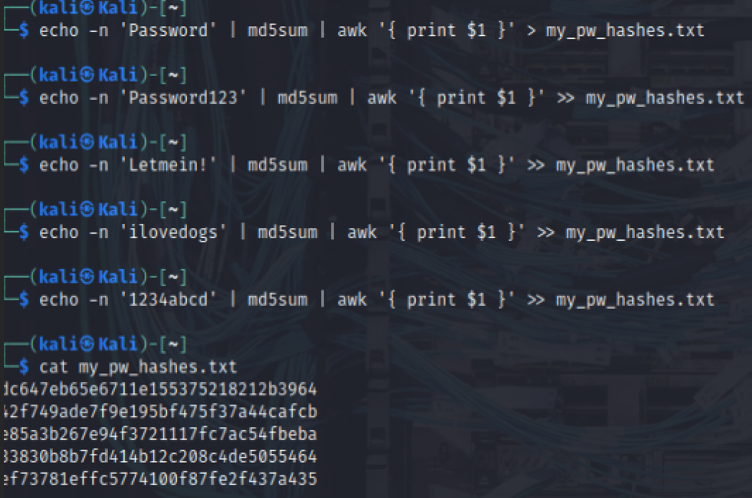

## Course Title: Penetration testing Course #: CS 4069

| **CS 4069** | **Ethical Hacking** | **Lab07** | **Spring 2026** |
| ----------- | ------------------- | --------- | --------------- |
| Name:       | Sarah Eid           |           |                 |
| Student ID: | S22107757           | Section:  | 1               |

**Lab 7 - Password Cracking (Tools)**

**Objectives**

In this lab, you will complete the following objectives:

- Part 1: Investigate Password Attacks
- Part 2: Crack Hashes with Hashcat Dictionary Attacks
- Part 3: Using the CUPP Tool to Generate Powerful Password Lists

**Background / Scenario**

Passwords are vulnerable to attack. Passwords are usually stored as encrypted hashes. An attacker can capture the hashes sent over the network using sniffing tools or can gain access to the files containing password hashes on vulnerable systems. When the attacker has the hashes, they can then apply dictionary, rainbow table, and brute force attacks against them offline to crack the hash to recover the plaintext passwords. There are many password attack tools included with Kali Linux. This lab will look at three popular tools; Hashcat, and CUPP.

**Instructions**

**Part 1: Investigate Password Attacks**

**Step 1: Log into Kali Linux and verify the environment.**

- Log into Kali using **kali** as the username and password.
- Select **Applications > 05 - Password Attacks**.

In the Kali Password Attacks menu, which four subcategories of password attack tools are available?

**_The four subcategories are:_**

- **_Online Attacks_**
- **_Offline Attacks_**
- **_Passing the Hash_**
- **_GPU Tools_**

**Step 2: Examine the available password attack tools.**

- Click each attack subcategory and review the available attack tools.
- Hover the cursor over each tool. Note that some tools have a popup text box containing a brief description of the tool. You can also search for the tools in the Kali Tools page to learn more about them and what they do.

Which tool is a Microsoft password cracker that uses rainbow tables? Which subcategory contains this tool?

- **_Tool: rcracki-mt (or rainbowcrack)_**
- **_Subcategory: Offline Attacks_**

**Part 2: Crack Hashes with Hashcat Dictionary Attacks**

**Step 1: Create a file that contains MD5 hashes to be cracked.**

First, some MD5 hashes of passwords are needed. In an actual exploit, an attacker will have already compromised a vulnerable system to obtain a password file containing stored password hashes to be cracked offline. In this step you simulate this by creating a password file that contains the hashes you will crack in an upcoming step.

- In a terminal window, create five target hashes by entering the following commands at the prompt:

**echo -n 'Password' | md5sum | awk '{ print \$1 }' > my_pw_hashes.txt**

**echo -n 'Password123' | md5sum | awk '{ print \$1 }' >> my_pw_hashes.txt**

**echo -n 'Letmein!' | md5sum | awk '{ print \$1 }' >> my_pw_hashes.txt**

**echo -n 'ilovedogs' | md5sum | awk '{ print \$1 }' >> my_pw_hashes.txt**

**echo -n '1234abcd' | md5sum | awk '{ print \$1 }' >> my_pw_hashes.txt**

Note that the passwords vary in complexity.

The hashes generated are written to the **my_pw_hashes.txt** file.

- Next, check the password hashes that you just created by entering the **cat** command.

---

**Step 2: Start Hashcat in Kali.**

- Open a new Kali console and enter the command: **man hashcat**.
- Review the options available in the first man page.

What is specified with the **\-m** and **\-a** options?

- **_\-m: Hash type (e.g., 0 = MD5, 1000 = NTLM)_**
- **_\-a: Attack mode (e.g., 0 = dictionary, 3 = brute force)_**

- Scroll through the man page output to find the values that can be supplied to each of these options.

Using the hashcat man pages, which hash type and attack mode would you use to crack the password hashes in the my_pw_hashes.txt file? Explain.

**_For MD5 hashes with dictionary attack:_**

- **_Hash type (-m): 0 (MD5)_**
- **_Attack mode (-a): 0 (Dictionary)_**

**Step 3: View available wordlists.**

Kali comes with several wordlists built in. Hashcat needs to use a wordlist to crack the hashes.

- To view the built-in wordlists, enter the command: **ls -lh /usr/share/wordlists/**.

┌──(kali㉿Kali)-\[~\]

└─\$ **ls -lh /usr/share/wordlists/**

This lists the wordlists that are distributed with Kali. We will use the **rockyou.txt** word list. The rockyou.txt wordlist is a password dictionary that contains more than 14 million passwords.

What needs to be done to the rockyou.txt.gz file before the wordlist text file can be used?

**_It needs to be extracted/unzipped using gzip -d_**

- Change the directory to **/usr/share/wordlists** by entering the command:

┌──(kali㉿Kali)-\[~\]

└─\$ **cd /usr/share/wordlists**

- Extract the rockyou.txt.gz file using the **gzip** command:

┌──(kali㉿Kali)-\[/usr/share/wordlists\]

└─\$ **sudo gzip -d rockyou.txt.gz**

- List the contents of the directory as was done previously using the **ls** command. Verify that the **rockyou.txt** file is now unzipped.

┌──(kali㉿Kali)-\[/usr/share/wordlists\]

└─\$ **ls**

- Use the **more** command, followed by the file name, to view the contents of the file to see some of the passwords that hashcat will use to crack your hashes.

┌──(kali㉿Kali)-\[/usr/share/wordlists\]

└─\$ more rockyou.txt

Wordlists for cracking hashes or brute forcing logins are often collected from password dumps that publicly disclose stolen user account information. Scroll through the output to get a sense of the file contents.

What seems to be a popular type of password? How could this trend be useful to a penetration tester?

**_Common words, names, dates, and sequential numbers (e.g., "123456", "password", "iloveyou")_**

- Press **q** or **Ctrl-z** to exit the file contents.
- Return to the home directory.

┌──(kali㉿Kali)-\[/usr/share/wordlists\]

└─\$ cd /home/kali

**Step 4: Crack hashes with Hashcat.**

- To crack the hashes contained in the **my_pw_hashes.txt** file use the following command:

┌──(kali㉿Kali)-\[~\]

└─\$ sudo hashcat -m 0 -a 0 -o cracked.txt my_pw_hashes.txt /usr/share/wordlists/rockyou.txt

This command outputs the cracked passwords in the new **cracked.txt** file.

- To view the contents of the cracked.txt file and the plaintext password enter the command:

┌──(kali㉿Kali)-\[~\]

└─\$ sudo cat cracked.txt

---

How many passwords were cracked?

**_All 5 passwords should crack successfully._**

**Part 3:** Using the CUPP Tool to Generate Powerful Password Lists

**1\. Installing and setting up CUPP in Kali Linux**

The first and most important step is installing CUPP on Kali. After booting to Kali Linux, open the terminal and create a directory for installing the CUPP tool.

Use the following command:

mkdir CUPP

This command creates a folder or directory where the files for the tool will be stored.

Navigate to this newly created directory:

cd CUPP

Inside the CUPP directory, clone the CUPP repository from Github:

git clone <https://github.com/Mebus/cupp.git>

If git doesn't work, it might not have been properly installed in the system. If so, use the command to update the sources and install it again: apt-get update && apt-get install git

**2\. Configuring CUPP after Installation**

Like a lot of hacking tools, CUPP, too, has a configuration file. Let's explore and customize its options. When the ls command is used after cloning CUPP, one can see that a new folder named "**cupp**" is created. Upon navigating to that folder, the config file should be visible:

cupp.config

The CUPP documentation is available in the README.md file inside the directory cloned with git.

Open the configuration with leafpad:

leafpad cupp.cfg

This opens a screen with many options. For now, let's focus on the "**1337 mode**" and special chars settings. What **1337 mode** does is simply going through all the passwords CUPP generated and replacing, for example, "**a**" with **4** in that password and adding the new password to the wordlist. This mode not only makes the wordlist larger but also greatly increases the chances of success. Note that **a** should be equal to "@" as well.

To do that, add this line under "**leet**": a=@

Special characters will be added randomly at the end of the passwords which CUPP generates. These need not be edited, but if one wants to, it can be done by adding a character to it. The other settings are quite self-explanatory.

**3\. Using CUPP**

Cd cup

./cupp

./cupp -i

CUPP can be launched in interactive mode by using the following command: python cupp.py -i

Enter all the information and particulars about the target. This information can be gained through OSINT research about the target. As an example, the imaginary "target" here will be John Smith.

Knowing about the target is important. In this case, one must collect details about John to effectively generate wordlists using CUPP. For this example, let's assume that John:

- Is an **electrician** by profession.
- Was born **05/10/1987**.
- Often Goes by the nickname "**Tirrian**"
- Has a **wife** named Barbara, but her nickname isn't known.
- His wife's birth date is **14/07/1989**.
- Has a **son** named **Alex**, whose nickname is unknown. His son was born on **19/03/2005**.
- Has a dog named **Laika**.
- Owns a **company** named **ElectricFab** (a fictitious company for this writeup)
- Is a **huge soccer fan** and supporter of **Real Madrid**.

Let's also assume John included barbara in his password, which is easy to remember, but replaced the a's with @'s to make it more secure. He further added the birthday of his wife, which is 14/07 but omitted the dashes. So, his password is mostly a combination of known information about him: B@rb@r@1407.

**Note:** This password contains a capital letter, is 8 characters long, has a number in it, and has a special character, which meets the minimum password complexity requirements on most sites. (John Smith is an imaginary person with no relation to anyone in real life)

Upon checking if CUPP can predict this password from the given data, it generated a dictionary of 37,000 possible passwords for John, called John.txt.

**4\. Using a Test case to determine if CUPP generates the password successfully**

To check whether CUPP successfully generated John's password, one can use leafpad to open the text file:

leafpad John.txt

Once it's opened, click "**search**" and click on "**find.**" Then, enter John's password.

Or,

Grep through the contents of the text file containing generated passwords like this:

cat John.txt | grep 'B@rb@r@1407'

Grep would highlight the portion of the wordlist where it found a match. Thus, CUPP's wordlist generation capabilities are quite advanced and powerful, as demonstrated through this simple example.

**Reflection Questions**

1\. Why is complexity and length so important with creating passwords?

**_Longer and more complex passwords exponentially increase the number of possible combinations, making brute-force and dictionary attacks significantly harder. A 12-character password with uppercase, lowercase, numbers, and symbols has trillions of possible combinations, while an 8-character lowercase password can be cracked in hours or minutes._**

2\. In addition to complexity and length, what other measures can be taken to protect passwords?

- **_Multi-Factor Authentication (MFA): Requires second factor (SMS, authenticator app, biometrics)_**
- **Account Lockout Policy: Locks account after failed attempts (e.g., 5 attempts)**
- **Salting Hashes: Adds random data to each password before hashing**
